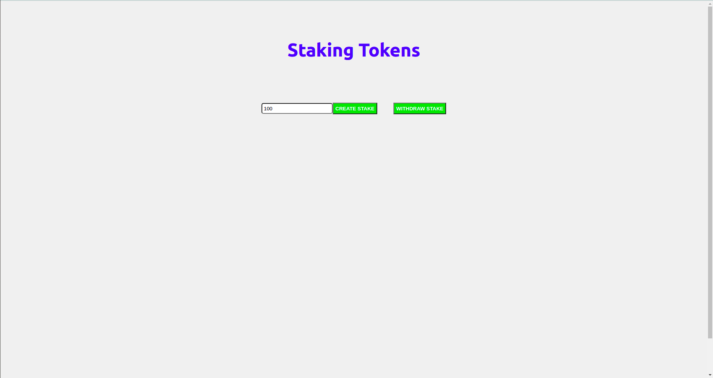

# ERC20 token based staking dapp


A user can stake his/her tokens once at a time and after every 7 days stakes will earn a reward of 5% of the stake amount.
## Prerequisites
- Solidity v0.8.0
- Truffle v5.4.5
- npm v7.11.2
- Metamask needs to be install in the browser

**NOTE:**
- Create a `.env` file at root level and add following two variables with appropriate values as they are required in `truffle.js` file:
    * MNEMONIC - 12 secret recovery phrase needed for your hardware wallet
    * ROPSTEN_KEY - Your **Infura** account's ropsten key

## Steps to run the code
1. Clone the repository
2. Install dependencies for truffle
```
npm i
```
3. Go inside client and install dependencies for react
```
cd client && npm i
```
4. Go back to root directory and compile contracts
```
cd ..
truffle compile
```
5. Deploy contracts to ropsten
```
truffle deploy --network ropsten
```
6. After successful deployment, you can see the transaction on etherscan. Now copy the deployed contract address and add your new created token in the metamask.
7. Run the react app
```
cd client && npm run start
```
